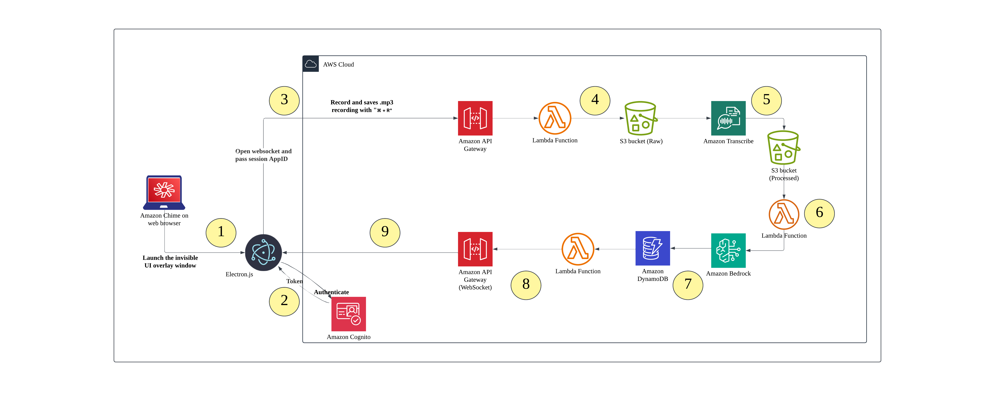

# SA Genie

A real-time meeting assistant that records Amazon Chime meetings, transcribes the audio, and provides an interactive overlay interface.

## Features
- 🎙️ Real-time audio recording from Amazon Chime meetings
- 🤖 AI-powered transcription and analysis
- 🖥️ Electron-based overlay interface
- ⌨️ Global keyboard shortcuts for control
- 🔄 Real-time status updates
- ☁️ AWS-powered backend infrastructure

## Architecture



The system consists of two main components:

1. **AWS Backend (aws-realtime-backend)**
   - Complete AWS infrastructure deployed via CDK
   - WebSocket API for real-time communication
   - Lambda functions for audio processing
   - Integration with AWS Bedrock for AI capabilities

2. **Electron Overlay (new-minimal-overlay-app)**
   - Transparent overlay window for status display
   - Global keyboard shortcut handling
   - WebSocket client for real-time updates
   - Built-in audio capture capabilities

## Prerequisites
- Node.js and npm
- AWS CLI installed and configured with credentials
- AWS CDK CLI installed globally (`npm install -g aws-cdk`)
- Access to Amazon Chime

## Installation and Setup

### 1. Deploy AWS Infrastructure
```bash
cd aws-realtime-backend
npm install
npm run build
cdk bootstrap  # Only needed for first-time CDK users
cdk deploy
```

After deployment, note down these values from the CDK output:
- WebSocket API Gateway URL (without https://)
- DynamoDB table name
- AWS Region

### 2. Configure Electron Overlay
```bash
cd new-minimal-overlay-app
npm install
npm run build
```

Create or modify the `.env` file in the new-minimal-overlay-app directory:
```
# Replace these values with your CDK output
API_GATEWAY_URL=your-api-gateway-url-here
AWS_REGION=your-aws-region
DYNAMODB_TABLE=your-dynamodb-table-name
```

Then start the application:
```bash
electron .
```

## Usage

1. Ensure your AWS credentials are properly configured in `~/.aws/credentials`
2. Start the Electron overlay app: `cd new-minimal-overlay-app && electron .`
3. Join an Amazon Chime meeting
4. Use keyboard shortcuts to control recording (⌘+R or Ctrl+R)
5. View real-time status in the overlay window

## Development

### Project Structure
```
sa-genie/
├── aws-realtime-backend/        # AWS CDK infrastructure
│   ├── bin/                     # CDK app entry point
│   └── lib/                     # Stack definition and Lambda functions
└── new-minimal-overlay-app/     # Electron overlay application
    ├── electron/               # Main process code
    └── renderer.js             # Renderer process code
```